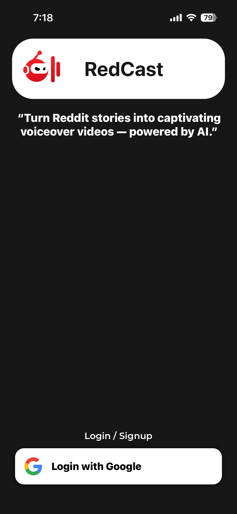
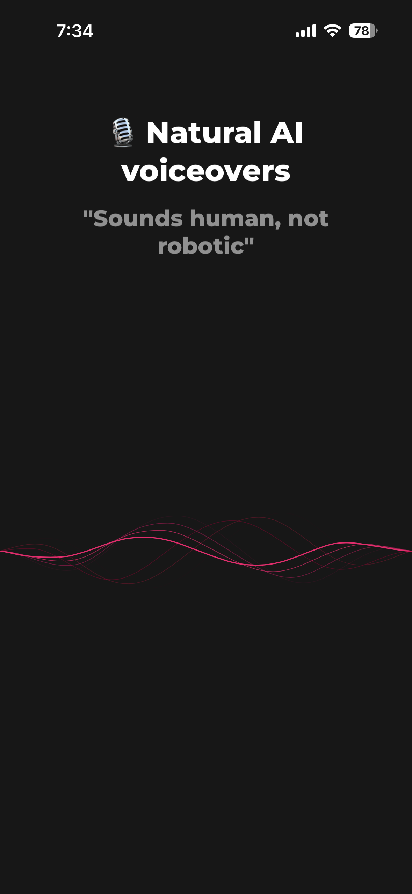
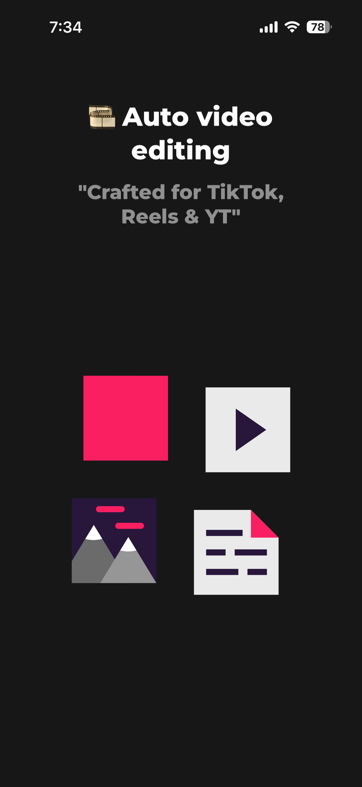
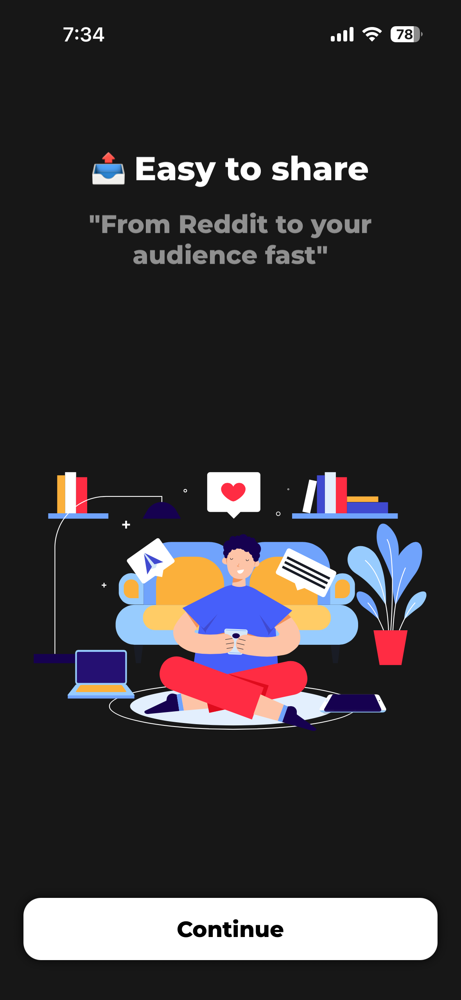
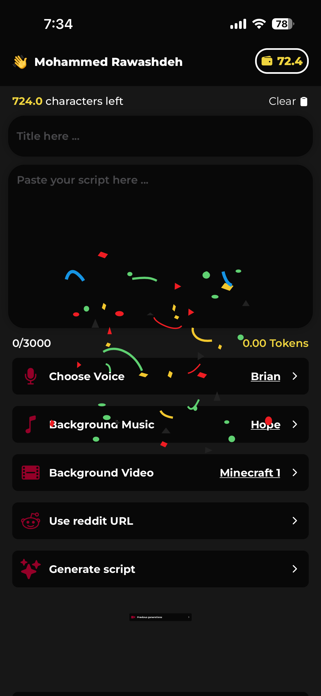
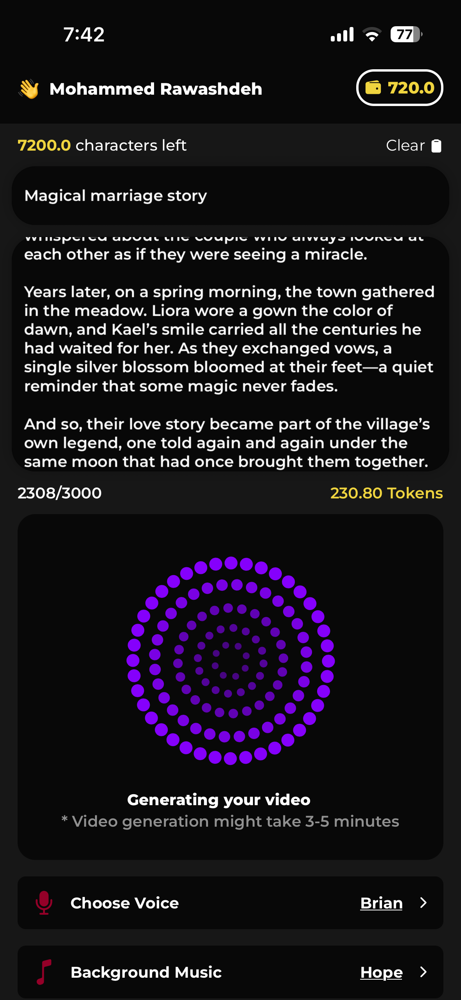
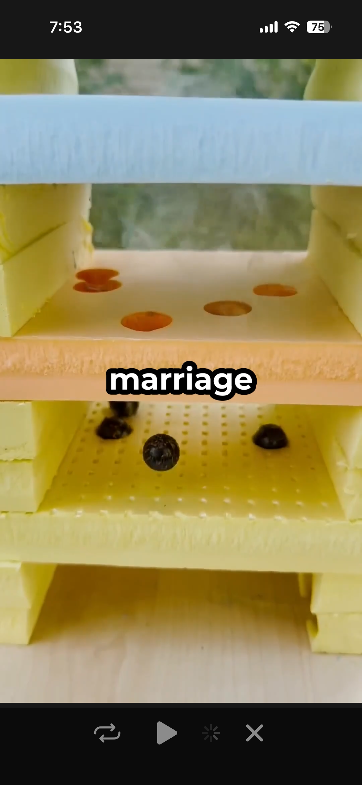

# RedCast AI 🤖🎥📸
This app is built in React Native in Expo framework, the backend used is built in : 
- Go: as http router and file server
- Redis: For job queue
- Job Bridge (Node JS Express): for handling jobs from the go backend, and send it to the Redis server and send the job to the worker
## Screenshots inside the app
       
## Video Record of animation inside the app
